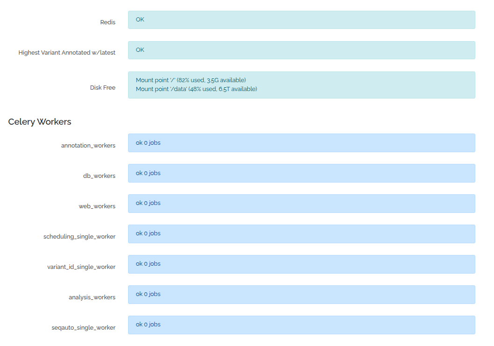

# Server Status

This page is admin only.

Access via clicking on username  (top right), then "Server Status"

This page performs a number of checks, including checking the status of the celery workers. They will be RED if the worker can't be found

It also shows SQL queries that are currently running (each environment has its own database)

SQL queries are automatically killed after 20 minutes, as they can sometimes go wrong and cause the system to lock up. You can kill a query by clicking on the red link in the "PID" column

This will cause the query to fail (eg grid or node will now error for the user)